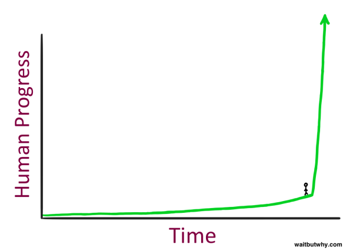

# Embracing the Dawn of the Information Industrial Revolution: AI as Our New Electricity

The winds of change are blowing, propelling us towards the next great epoch in human history - the Information Industrial Revolution, powered by Artificial Intelligence (AI). Like the transformative forces of fire and electricity, AI is poised to ignite a transformation that will redefine every aspect of our lives and societies.

## Reflecting on the Evolution of Industrial Revolutions

Before we delve into the potential of AI, let's journey back in time to understand the gravity of the shift we are about to witness.

### Industrial Revolution 1.0: Mechanization

The First Industrial Revolution introduced mechanization and steam power, swapping manual labor for machines. This transition turned agrarian societies into industrial powerhouses, marking the genesis of unprecedented economic productivity.

### Industrial Revolution 2.0: Electrification

The Second Industrial Revolution was sparked by the advent of electricity, a revolutionary force that not only powered our homes and industries but also altered societal rhythms. By extending workable hours into the night, electricity made time a commodity.

### Industrial Revolution 3.0: Digitization

The Third Industrial Revolution, or the Digital Revolution, ushered us into the Information Age. As Jeff Bezos said in his TED Talk, the internet was to society what electricity was to the industrial world, transforming communication, work, and access to information.

| Industrial Revolution | Key Driver    | Impact |
|-----------------------|---------------|--------|
| 1.0                   | Mechanization | Transformed agrarian societies into industrial ones, boosting economic productivity. |
| 2.0                   | Electrification | Altered societal rhythms and made time a commodity. |
| 3.0                   | Digitization   | Transformed communication, work, and access to information. |

## AI: The Catalyst of the Fourth Industrial Revolution

> "Just as electricity transformed almost everything 100 years ago, today I actually have a hard time thinking of an industry that I don’t think AI will transform in the next several years." - Andrew Ng

As we stand at the cusp of the Fourth Industrial Revolution, AI is set to be our new electricity. It's the force that will drive the Information Industrial Revolution, reshaping every industry, from healthcare and education to finance and transportation.

AI's transformative power lies in its capacity for learning, adaptation, and decision-making. It mirrors human intelligence but on a scale and speed that far surpasses human capabilities. However, like any potent force, it's a tool that requires careful and ethical handling. 

## Preparing for the Future: Education, Regulation, and Innovation

So, how do we brace ourselves for this new era? The answer lies in three key areas: 

1. **Education** – Equip our workforce and future generations with AI knowledge and skills.
2. **Regulation** – Establish rules that ensure ethical use of AI while still fostering innovation.
3. **Innovation** – Push the boundaries of AI application to solve pressing global challenges.

## The Future is Here

The Information Industrial Revolution isn't a distant dream; it's unfolding right now. As AI permeates every aspect of our lives, we stand at a pivotal point in history. We have the opportunity to harness this new electricity to shape a future that is smarter, more efficient, and equitable. As we step into this new era, let's strive to distribute the future evenly, harness the power of AI, and shape the world we want to see.